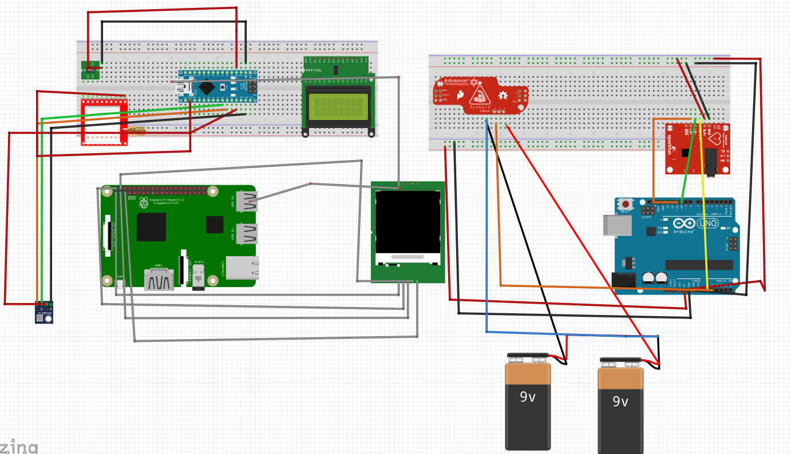

# HealthHack
A next gen healthkit that reads ECG, EMG, Temperature, Pressure, Blood Alcohol Conc and takes Thermal Images to diagnose medical conditions anywhere, anytime.

```
In India, more than 50% of people don't reach a hospital on time when they get a heart attack. More than 60% of our ambulances are ill equipped to diagnose conditions, which means the patients vital parameters are anyone's guess until they reach the hospital.

Moreover, with the advent of Motorcycle ambulances to deal with traffic, this has worsened since they carry no diagnostic tools. What is the need of the hour is a cheap, portable, easy to use solution for their diagnostics needs. Patients who are stabilised before being transported have a 8X higher chance of survival.

We built such a system and a companion app to enable quick and easy diagnostics anytime, anywhere.
```
### Current Mobile Application screen recording is [here](https://drive.google.com/open?id=16PlDe_pkNudPTPNehzPI4a-LhLSY39hV)

## Refer to circuit diagram for schematics

## Technologies used

### Open Source Copy-Left Hardware 

1. Arduino UNO - To interface with the sensors

2. Arduino Nano - To measure the environment variables and the drive the ILI9341 display

3. AD8232 - To measure ECG

4. Advancer Myoware V3 - To measure EMG

5. BMP180 - Measure harometric pressure and temperature

6. Neo 6M - GPS

7. DS18B20 - To measure body temperature

8. Raspberry Pi Model 4B - To interface with both the arduinos and the drive the 5" LCD Display

9. KY039 - To measure pulse

### Open Source Software

1. React Native - Build cross-platform mobile application

2. Raspbian - Open Source Linux Distro on Raspberry Pi

3. PuTTy - Open Source Terminal Emulator

4. Arduino - Programming Language


## Please note that all the code is loaded through the Raspberry Pi
